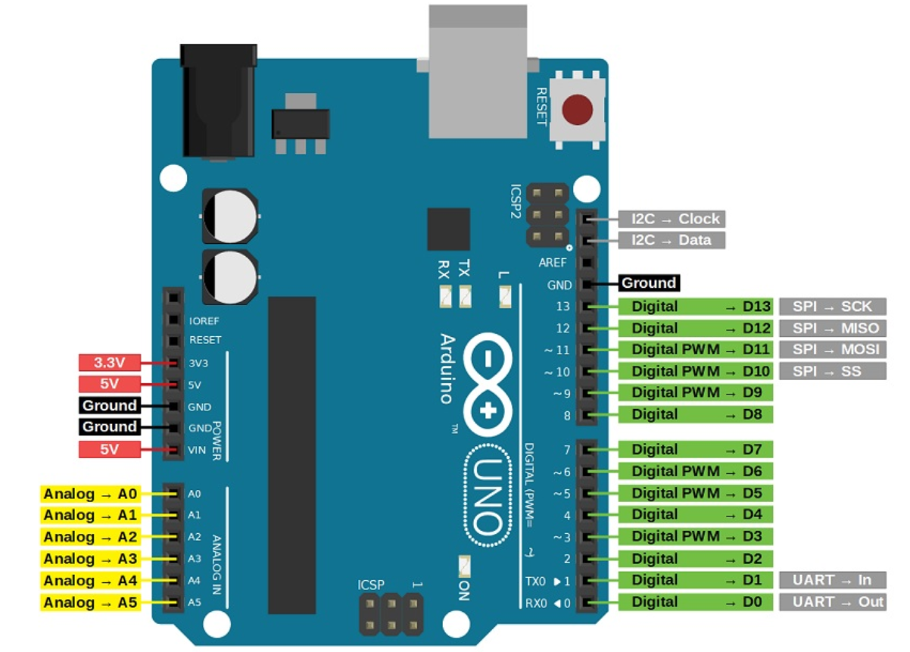

# 🛠️ Arduino Basics - Getting Started  

Welcome to the **Arduino Basics** section! 🎉  

This section is designed to help you get started with **Arduino**. You'll learn how to set up the **Arduino IDE**, write your first program, and understand the pin configurations used for digital and analog I/O operations.

---

## 🎯 What You’ll Learn  
In this section, you will learn:
- ✅ How to **install the Arduino IDE**  
- ✅ How to **set up your Arduino board**  
- ✅ How to **write and upload your first program**  
- ✅ How to **understand pin configurations** and how they work for basic input/output tasks  


---

## 1️⃣ **Installing Arduino IDE**  

Before you can start programming with Arduino, you'll need to install the **Arduino IDE** on your system.

### **🔹 Steps to Install Arduino IDE**  
1. Go to the [Arduino IDE download page](https://www.arduino.cc/en/software).  
2. Select the appropriate version for your operating system (Windows, macOS, or Linux).  
3. Follow the installation instructions to complete the setup.

For more detailed instructions, follow these links:
  - [Installation Guide link for Windows](https://docs.arduino.cc/software/ide-v1/tutorials/Windows/) <br>
  - [Installation Guide Link for macOS](https://docs.arduino.cc/software/ide-v1/tutorials/macOS/) <br>
  - [Learn Arduino code](https://docs.arduino.cc/language-reference/?_gl=1*1fzdi51*_up*MQ..*_ga*MzMyOTcyNjE2LjE3MzY2MjQ1ODc.*_ga_NEXN8H46L5*MTczNjYyNDU4NC4xLjEuMTczNjYyNDU4OS4wLjAuNTMzMjg0MTkx) <br>
  - How to write and upload the code to Arduino YouTube video link: [Upload Code Guide](https://www.youtube.com/watch?v=y5znFDmY5V4)

Once installed, you can launch the **Arduino IDE** and get ready to write your first program!

---

## 2️⃣ **Setting Up Your Arduino Board**  

Now that the IDE is installed, let's connect your **Arduino board** to your computer.

### **🔹 Steps to Set Up Your Board**  
1. **Connect your Arduino** to your computer via a **USB cable**.  
2. Open the **Arduino IDE** and :navigate to:
   - **Tools > Board > Select your Arduino model** (e.g., Arduino Uno).  
   - **Tools > Port > Select the correct COM port** (Windows) or `/dev/ttyUSB` (Mac/Linux).

Once your board is set up, you can move on to writing code!

---

## 3️⃣ **Writing and Uploading Your First Program**  

Now that your board is connected, let’s write our **first Arduino program**!  

### **🔹 Blink an LED**  

This basic program will make the **built-in LED** on your Arduino blink every second.

```cpp
void setup() {
  pinMode(LED_BUILTIN, OUTPUT);  // Set the built-in LED as an output
}

void loop() {
  digitalWrite(LED_BUILTIN, HIGH);   // Turn the LED on
  delay(1000);                       // Wait for 1 second
  digitalWrite(LED_BUILTIN, LOW);    // Turn the LED off
  delay(1000);                       // Wait for 1 second
}
```
### **🔹 Program Explanation**  

   - **setup():**  This function runs once when the Arduino is powered up or reset. It initializes the LED_BUILTIN pin as an output.
   - **loop():** This function runs repeatedly, turning the LED on and off every 1 second (1000 milliseconds).

### **🔹 Uploading Your Program** 

1. Click the Upload (→) button in the Arduino IDE to send the code to your Arduino.
2. After uploading, the LED should start blinking every second!

## 4️⃣ **Understanding Pin Configurations** 

Before diving into using pins, let's take a look at the **Arduino board** and understand its different pins and their functions.

### **🔹 Arduino Pinout Image** 


<!--   -->
<!-- *Image Source: [Arduino Offiial](https://www.arduino.cc/)* -->

This image shows the **pinout diagram** of an **Arduino Uno** board. The pins on your board will be used for both **input** (reading data) and **output** (sending data), which are essential for connecting sensors, motors, and other devices to your Arduino.

For a more detailed view of the **pin diagram**, click the link below:

- [Click here for a detailed Arduino pinout diagram](./images/Arduino_pinout_detailed.png)

---

### **🔹 Types of Pins** 

| **Pin Type**    | **Description**                                                       |
|-----------------|-----------------------------------------------------------------------|
| **Digital Pins** | Used for **HIGH (1)** or **LOW (0)** signals.                        |
| **Analog Pins**  | Used for **analog input** with values between **0 to 1023** (mapped to 0V to 5V). |
| **PWM Pins**     | Digital pins that simulate **analog output** using **Pulse Width Modulation (PWM)**. |
| **Power Pins**   | Provide **5V**, **3.3V**, and **Ground (GND)** for powering external components. |

---

### **🔹 Pin Mapping (Arduino Uno)** 

Here’s a breakdown of the key pins found on an **Arduino Uno**:

| **Pin Name**    | **Function**                        |
|-----------------|-------------------------------------|
| **D0 - D13**    | **Digital I/O pins**                |
| **A0 - A5**     | **Analog input pins**               |
| **GND**         | **Ground (0V)**                     |
| **5V, 3.3V**    | **Power supply for components**     |

### **🔹 Pin Descriptions**
- **D0 - D13**: These are **digital I/O pins**. You can use them for both **input** (e.g., reading a button press) and **output** (e.g., controlling an LED).  
- **A0 - A5**: These are **analog input pins**. They can read values from **0 to 1023**, which corresponds to an **analog signal** that can range from **0V to 5V**.  
- **GND**: This is the **Ground** pin, providing a reference voltage (0V) for the circuit. It completes the electrical circuit by connecting to the negative side of external components.  
- **5V, 3.3V**: These pins provide power for external devices:
   - **5V**: Supplies 5 volts for most components (e.g., sensors).
   - **3.3V**: Provides 3.3 volts, often used for low-voltage components.
   
---

## 🛠️ Troubleshooting

When working with Arduino, you might encounter a few common errors. Here are some troubleshooting tips to help you resolve them quickly.

---

### 🔹 Error: "Pin Mode Not Set"  
### **Solution**:  
Ensure that you’ve called **pinMode(pin, mode)** for each pin in the **setup()** function before using the pin.  
- **Example**:
    ```cpp
    void setup() {
      pinMode(LED_BUILTIN, OUTPUT);  // Set pin as output for controlling LED
    }
    ```
- This sets the pin mode to **OUTPUT**, allowing the pin to be used to send signals.

### 🔹 Error: "Invalid Pin Value"  
### **Solution**:  
Check that the correct **pin number** is being used for the type of pin. Ensure you are using a **digital pin** (D0 to D13) for **digital operations**, and **analog pins** (A0 to A5) for **analog inputs**.  
- **Example**:
    ```cpp
    int sensorValue = analogRead(A0);  // Correct usage for reading analog values from A0
    ```

If you're using a **digital pin** in your code, make sure the pin number is correct:
- **Digital Pins**: Use pin numbers from **D0 to D13**.
- **Analog Pins**: Use pin numbers from **A0 to A5**.

---

## 📢 Next Steps

Now that you've learned about **pin configurations** and troubleshooting tips, you can continue exploring more advanced Arduino topics. Here are some important areas to continue your learning journey:

### ✅ **[GPIO Read/Write](./GPIO/)**
- ⚡ Controlling **LEDs, buttons, and sensors**  
- 📡 Understanding **digital & analog I/O**  
- 🔌 Working with **Pulse Width Modulation (PWM)**  

### ✅ **[Sensors & Motors](./Sensors_Motors/)**
- 🤖 Interfacing with **temperature, ultrasonic, and light sensors**  
- 🚀 Controlling **servo motors, DC motors, and stepper motors**  
- 🔗 Connecting **multiple components for robotics and automation**  

### ✅ **[Serial Communication](./Serial_Communication/)**
- 🔄 Sending & receiving **data between Arduino boards**  
- 📡 Establishing communication with **ESP32 & Raspberry Pi**  
- 🔗 Using **I2C, SPI, and UART protocols**  

---
<!-- 


<div align="center">
  
</div>


# Experiment : Introduction to Arduino UNO.

## Objective: 
This documentation aims to provide a beginner-friendly guide to getting started with Arduino and ESP32 development. It covers the installation of the Arduino IDE, initial setup for Arduino and ESP32 boards, and testing with a simple "Blink" program to ensure the setup works correctly. The goal is to empower students to build confidence in using these platforms for future projects.


## Arduino Launch History :  
You’ll need arduino IDE to get started with the arduino and esp32 programming. To get the latest version of the IDE follow this link and follow the instructions.

[IDE download link](https://www.arduino.cc/en/software) <br>
[Installation Guide link for Windows](https://docs.arduino.cc/software/ide-v1/tutorials/Windows/) <br>
[Installation Guide Link for macOS](https://docs.arduino.cc/software/ide-v1/tutorials/macOS/) <br>
[Learn Arduino code](https://docs.arduino.cc/language-reference/?_gl=1*1fzdi51*_up*MQ..*_ga*MzMyOTcyNjE2LjE3MzY2MjQ1ODc.*_ga_NEXN8H46L5*MTczNjYyNDU4NC4xLjEuMTczNjYyNDU4OS4wLjAuNTMzMjg0MTkx) <br>
How to write and upload the code to Arduino:  [Upload Code Guide](https://youtu.be/xQfC72VeV7Y?si=Ls96MXAMnVyEDich)

## Features of Arduino: 
* Open-Source Hardware and Software
* Cross-Platform Support
* Easy-to-Use Programming
* Wide Range of Boards
* Input/Output (I/O) Capabilities
* Serial Communication
* Expandability with Shields
* Large Community and Documentation


## Arduino pin diagram : 

<div align="center">
  
</div> -->
