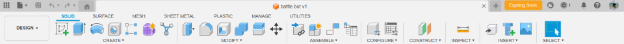
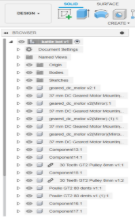
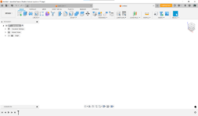
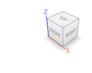
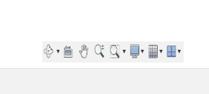
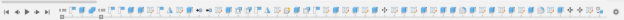
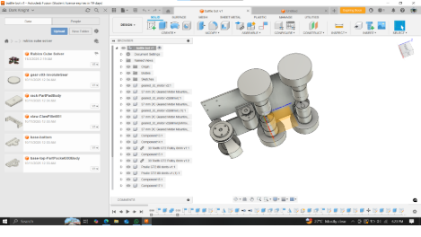

## **Understanding The Interface**
- ## Toolbar
**(The strip at the highest)**

This is just your tool collection, you know? It’s got all the buttons. Drawing stuff, building stuff—it’s all there. And it's cool because it basically reads your mind; if you switch to a different task, the whole strip of tools switches automatically. Like, poof, new tools.

-----
##
- ## Browser Panel

**(The vertical list on the left)**

Okay, so you build stuff, right? This list is your running list of literally everything you've made. Every single line, every bolt, every little block. If your design gets crazy busy, this list is how you find that one piece you need to hide or maybe rename it so you don't forget what it is. It's your project inventory.

-----
- ## **Canvas Area**
**(The large space)**

Well, this is the main spot. Your digital desk. Everything you build—that’s where it lives. This is where all the action and the fun happen. You see your work right here.

-----
- ## **ViewCube**

**(The small box, top right)**

I call this the camera holder. You click it to look at the top, or the front, or whatever. Or you can just grab it and spin the whole model around with your mouse, like you're holding it up in the air. Easy way to look at the back side.

-----
- ## **Navigation Bar**

**(Down below that box)**

These are just the controls for your view. They let you slide the picture around, or zoom way in on a tiny detail, or spin the model slowly. They also have buttons to change how the model looks—like shiny or clear or whatever you need.

-----
##
- ## **Timeline**
**(The bar way down at the bottom)**
This thing is awesome. It's your undo history on steroids. Every single action is recorded here. If you did something ten steps ago and realized it was wrong, you jump back, fix only that one thing, and everything else you built snaps into place correctly. It's the master editor.

-----
- ## **Data Panel**
**(The button top-left)**
This just opens up your folder system. It's where all your saved designs and projects live. Click it, find your file, and open it. Super simple filing cabinet.

-----
## 
