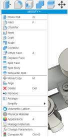
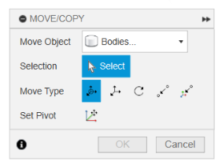
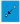
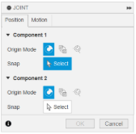
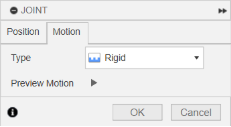
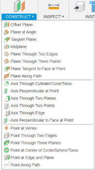

**3D Feature Creation**\
After your sketch is done, you use these tools to give it volume and make copies.

- **Extrude:** This is how you "pull" a **2D shape** into a **3D solid**. You select the closed **sketch** and set the depth. You can **add** material (**Join**) or **remove** it (**Cut**).
- **Mirror:** Makes a perfect, identical copy flipped across a reference line or **plane**.
- **Pattern:** Instead of copying things one-by-one, you use this to make many copies (of a feature or a whole object) following a straight (**linear**) or round (**circular**) path.
-----
**3D Modification**\
These tools help you smooth out rough spots, hollow out parts, or change the overall size.

- ** Fillet:** **Rounds off** a sharp edge or corner. You select the edge and set the curve's **radius**.

- ** Chamfer:** **Cuts a flat angle** on a sharp edge instead of rounding it. You set the **distance** and **angle** of the cut.

- **** Shell: **Makes a solid part hollow**, like a plastic bottle. You pick the faces you want to remove to create the opening and set the **wall thickness**.

- ** Scale:** Makes the entire object bigger or smaller by multiplying its size by a **scale factor**.

- ** Combine:** **Merges** two or more solid parts into a single body. You choose whether to **join** (add), **cut** (subtract), or **intersect** them.

- ** Split:** Uses a **face or plane** like a knife to cut one solid body into two or more separate pieces.

## **Moving Things**
- **Move:** Shifts or rotates an object along the **X, Y, or Z directions** by specific amounts.

- ** Point-to-Point Move:** A fast way to move. You pick one **point on the object**, and then pick the exact **spot in space** where you want that point to end up.

- ** Pivot:** This lets you temporarily set a custom **center point** (**pivot**) for rotation, so you can spin the object around a specific spot.
-----
**Assembly & Joints**

Joints tell the software how separate components should interact and move together.

- ** Joint Tool:** You pick **snap points** (like corners or center spots) on the two parts you want to connect.
- **Joint Types: Click on the Tab “Motion”**
  - ** Rigid:** **Locks** the parts together completely—they can't move at all.
  - ** Revolute (Spin) & Slider (Slide):** These allow movement. You need to set the **Minimum** and **Maximum** positions to limit how far the part can spin or slide.
  
  

- **Preview:** Always use the motion **preview** to watch the joint work and make sure it's doing what you expect!
-----

**Construction Tools**\
These tools create things that aren't part of the final product (like planes or lines) but help you sketch or build features on complicated parts.

- ** Offset Plane:** Makes a new plane that is **parallel** to an existing surface, just moved by a certain **distance**.

- ** Plane on the Edge:** Selects a straight **edge** and creates a plane rotated off that edge by a specific **angle**.

- ** Mid Plane:** Creates a plane exactly **in the middle** of two selected faces.

- ** Tangent Plane:** Creates a plane that just **touches** a curved surface (like a **cylinder**) without going inside it.
